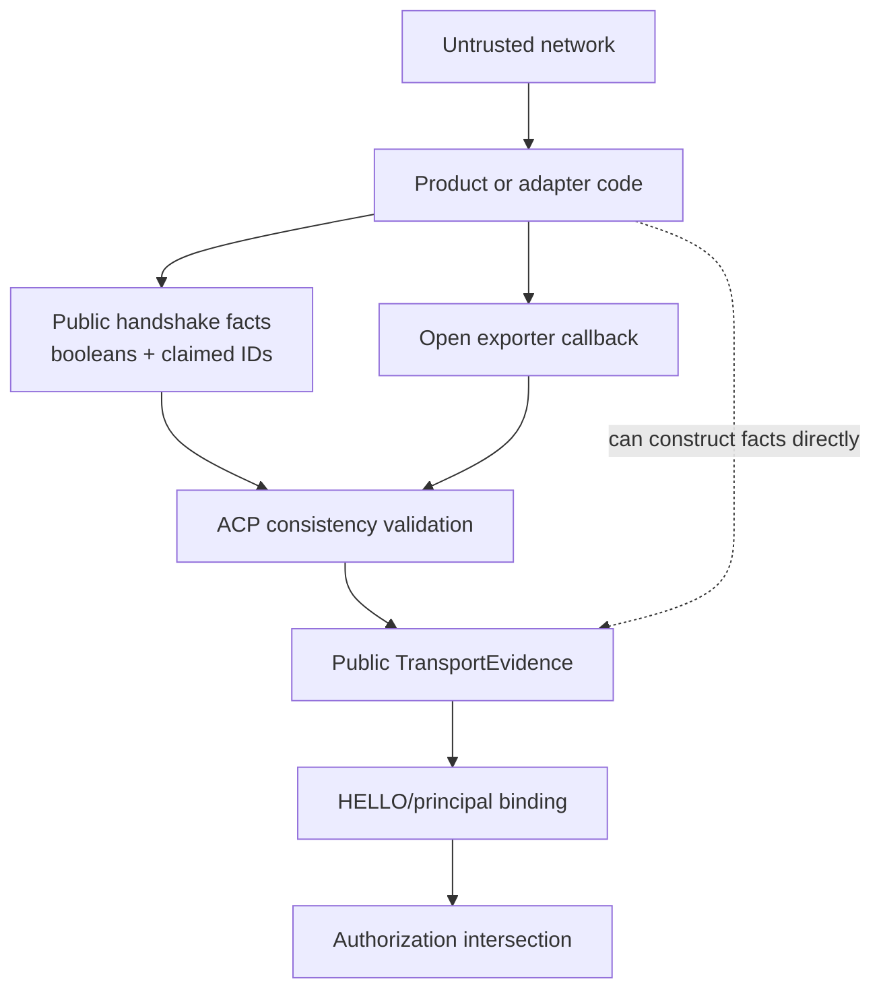
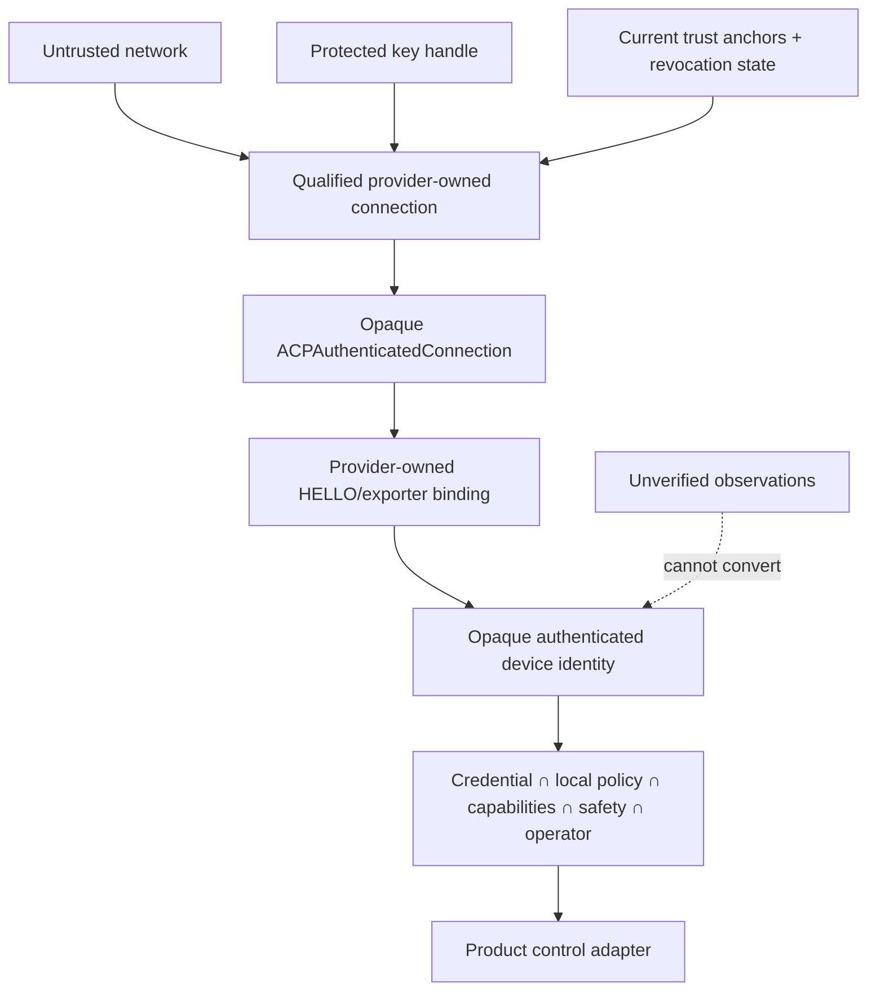

# ACP Post-M8 Security Closure Plan

> **Historical record.** This document preserves the plan, review, or evidence at the time it was written. For current normative and integration guidance, start at [`docs/README.md`](../docs/README.md).

Date: 2026-08-26  
Repository: `/Users/dakota/code/AuroraCommunicationsProtocol`  
Planning baseline: branch `main`, commit `597f5d79cffbb462873eb243ea1ca36ec0def777`, with the audited dirty working tree preserved  
Status: implementation-ready plan; no implementation is authorized by this document

## 1. Executive summary

ACP M0–M8 is an externally reviewable protocol/SDK candidate, but it is not yet a credible show-critical production trust boundary. The remaining release blocker, AT-IA-001, is not solved by adding another validator around public booleans. Today application code can construct `ACPFullTLSHandshake`, Python `FullTLSHandshake`/`TransportEvidence`, and Rust `FullTlsHandshake`/`TransportEvidence`, assert that certificate and trust-store checks passed, and feed those assertions into principal construction. The existing code checks internal consistency but cannot prove provenance.

The closure architecture must make a qualified transport/provider the only normal producer of an opaque authenticated connection. That provider must perform TLS/SPAKE2+/credential validation itself, obtain the exporter from the same live channel, bind ACP HELLO, consult current revocation state, and return a non-forgeable library-owned result. Product code receives an authenticated connection and device identity; it never supplies `peer_certificate_valid = true` or equivalent facts.

The recommended initial production support matrix is deliberately narrow:

- Prism on qualified macOS arm64.
- Aurora Remote on qualified physical iOS devices.
- Bridge on qualified Linux x86_64 and Raspberry Pi 5/arm64 where required for the first release.
- Python remains reference tooling/orchestration, not a production control endpoint, until a native opaque adapter is separately justified and qualified.
- Pico-class Lightweight targets remain unsupported for show-critical production until the provider, entropy, key-storage, and HIL milestones pass.

No frozen M0/M1 wire, transcript, key-schedule, credential, revocation, identifier, migration, or channel-binding change is currently necessary.

## 2. Audit finding disposition

| Finding | Severity | Verified disposition | Planning action |
|---|---|---|---|
| AT-IA-001 production adapters/evidence provenance absent | BLOCKER | Open | Closed by milestones S9–S14; final closure occurs only when required product paths cannot manufacture evidence and their adapters are qualified |
| AT-IA-002 Rust identity-store substitution | HIGH | Resolved | Preserve `HostIdentityStore::new/atomic_write` hardening and symlink regression |
| AT-IA-003 Swift secret data race | MEDIUM | Resolved | Preserve serialized `ACPSecretBytes` access and concurrency regression |
| AT-IA-004 Swift alignment-sensitive loads | MEDIUM | Resolved | Preserve bytewise CBOR/frame parsing |
| AT-IA-005 decoder total bounds | MEDIUM | Resolved | Preserve 8 MiB public decoder gates and boundary tests |
| AT-IA-006 Rust Lightweight format mismatch | MEDIUM | Resolved | Preserve `CredentialFormat::CompactV1` requirement and negative test |
| AT-IA-007 Python operational-state bound | MEDIUM | Resolved | Preserve 16 MiB pre-parse bound and oversized-state test |
| AT-IA-008 frame flag differential | LOW | Resolved | Preserve exact 0/1 semantics; add explicit three-SDK reserved-bit vectors in S9 |
| AT-IA-009 best-effort zeroization | INFORMATIONAL | Accepted with hardening | Address without protocol churn in section 20 |
| AT-IA-010 audit chain lacks independent root | INFORMATIONAL | Accepted with deployment option | Address in section 21 |
| AT-IA-011 Rust plaintext default | HIGH | Resolved | Preserve `allow_plaintext = false`; trusted-LAN fixtures must opt in visibly |
| AT-IA-012 Swift outbound frame bound | MEDIUM | Resolved | Preserve outbound 8 MiB rejection and add transport-write negative |

The resolved findings appear genuinely resolved. No reopened finding or new protocol vulnerability was found during planning.

## 3. Verified current-state assessment

### Swift

- Provider contracts are public in `Sources/AuroraACP/Security/ACPSecurityProviders.swift`.
- `ACPFullTLSHandshake` has a public initializer and caller-supplied security booleans in `Sources/AuroraACP/Security/ACPAuthenticatedTransport.swift`.
- `ACPTransportEvidence` has a public initializer in `Sources/AuroraACP/Session/ACPSecurity.swift`.
- `ACPAuthenticatedTransport.fullEvidence` validates those values and the exporter/HELLO equality, but the caller chooses both the handshake record and exporter implementation.
- `ACPKeychainCredentialBackend` stores credential-slot data with `kSecAttrAccessibleAfterFirstUnlockThisDeviceOnly`; it is not a production private-key/Secure Enclave implementation.
- `ACPTwoSlotIdentityStore` provides transactional credential metadata installation; private-key lifecycle remains behind an interface.

### Python

- `TransportEvidence` and `FullTLSHandshake` are ordinary public dataclasses in `python/src/acp/security.py` and `python/src/acp/security_transport.py`.
- `full_transport_evidence` accepts a caller `TLSExporter` callable plus caller facts.
- `bind_hello_auth` and `principal_from_verified_evidence` correctly fail closed on inconsistent evidence, but cannot distinguish provider output from application construction.
- Provider definitions in `python/src/acp/security_providers.py` are structural `Protocol` interfaces; Python provides no enforceable constructor boundary.
- The strongest current role is reference SDK, conformance tooling, operations, and test orchestration.

### Rust

- `FullTlsHandshake` and `TransportEvidence` have public fields in `rust/acp-security/src/transport.rs` and `rust/acp-security/src/lib.rs`.
- Any downstream crate can construct the facts; `TlsExporter` is an open trait.
- `full_transport_evidence` validates facts and exporter equality but not their provenance.
- Provider traits are boundaries, not production implementations. The workspace depends on RustCrypto hashing/HMAC only; Botan exists in probes, not a shipping adapter.

### Shared security behavior

Canonical context/transcript/key schedule, credential parsing, revocation, enrollment state, downgrade policy, authenticated-principal binding, permission intersection, reset, migration, and production Remote authorization boundaries are implemented and tested. `tools/security-probe` proves selected Botan/platform capabilities but explicitly does not prove adapter or product wiring.

### Resolved-finding verification detail

| Finding | Implementation evidence | Current regression evidence | Planning note |
|---|---|---|---|
| AT-IA-002 | `HostIdentityStore::new/atomic_write` rejects symlink roots and uses exclusive unique temporary files | `host_identity_store_rejects_symlink_root_and_ignores_predictable_symlink` | Complete |
| AT-IA-003 | `ACPSecretBytes` serializes description, access, clear, and destruction with a recursive lock | `testSecretConcurrentAccessAndClearAreSerialized` | Complete; zeroization guarantee remains informational only |
| AT-IA-004 | `ACPCbor` and `ACPFramed` decode integers bytewise | Swift malformed corpus and framed regressions | Fix is present; add a deliberately offset-buffer regression in S9 for the original alignment precondition |
| AT-IA-005 | all public Swift/Rust envelope decoders and Python raw CBOR enforce 8 MiB | Swift/Rust oversized decoder tests plus Python codec suite | Add exact-at-limit parity case in S9 |
| AT-IA-006 | Rust preface requires `CredentialFormat::CompactV1` | wrong-format branch in `lightweight_preface_and_finished_are_bounded` | Complete |
| AT-IA-007 | `OperationalStateStore.load` stats and bounded-reads before JSON | `test_operational_state_rejects_oversized_file_before_json_parsing` | Complete |
| AT-IA-008 | all framed receivers accept flags 0/1 only | broad framed negative/interoperability suites | Fix is present; add explicit values 2, 3, and 255 in all SDKs during S9 |
| AT-IA-011 | Rust `Session::new` sets `allow_plaintext = false`; fixtures explicitly opt in | `plaintext_required` and full interoperability | Complete |
| AT-IA-012 | Swift `ACPFramed.send` rejects over 8 MiB before `UInt32` conversion/write | full Swift suite | Fix is present; add a mock-transport “no bytes written” limit-plus-one regression in S9 |

The missing focused cases above are coverage-strengthening tasks, not evidence that the underlying remediations are absent or bypassable. They are required before S9 exits.

## 4. Root-cause analysis of AT-IA-001

The root cause is a provenance collapse: observations, provider-verified facts, and authenticated identity share publicly constructible record types. Validation answers “are these claims mutually consistent?” but not “who established them, using which live connection and qualified provider?”

Construction boundaries to remove from normal production API are:

- Swift `ACPFullTLSHandshake.init`, `ACPTransportEvidence.init`, and arbitrary `ACPTLSExporter` use with `ACPAuthenticatedTransport.fullEvidence`.
- Python `FullTLSHandshake(...)`, `TransportEvidence(...)`, arbitrary exporter callables, and direct calls to principal binding.
- Rust public `FullTlsHandshake`/`TransportEvidence` fields and arbitrary `TlsExporter` implementations.
- Lightweight validation closures that can return fabricated active evidence.

The problem spans the ACP library, reusable adapters, product connection factories, OS/native providers, and qualification infrastructure. It cannot be closed solely in Prism or solely by a Botan capability PASS.

## 5. Existing trust/evidence boundary



## 6. Proposed trust/evidence boundary



Security property: no public initializer, protocol callback, deserializer, test hook, or product field can turn assertions into an authenticated identity. Negative proof: compile-time/API tests plus runtime tests attempt every former construction path and fail before principal creation.

## 7. Production adapter architecture

### 7.1 Core ACP types

Introduce three separate concepts:

1. `UnverifiedPeerObservation`: diagnostic-only TLS/certificate metadata; never accepted by authorization.
2. `ACPAuthenticatedConnection`: opaque, non-Codable/non-serializable, provider-created live connection owning transport, peer identity, credential constraints, profile, channel-binding result, revocation epoch, and provider qualification identifier.
3. `ACPAuthenticatedPrincipal`: created internally from the opaque connection after ACP HELLO/exporter verification.

The authenticated connection must be tied to one live channel and consumed exactly once by session establishment. It must not be clonable into a different connection, restored from disk, or initialized from JSON/CBOR.

### 7.2 Language mechanisms

- **Swift:** add an `AuroraACPAppleSecurity` package target. Use Swift `package` access for evidence initializers/factories shared within the package, while keeping public read-only identity views. Product modules receive a public connection interface but cannot initialize its provider token. Remove/deprecate public `ACPFullTLSHandshake` and `ACPTransportEvidence` construction for production; retain internal test factories under the test target only.
- **Rust:** make evidence fields private and constructors `pub(crate)`. Add a sealed internal provider-result trait and an `acp-security-botan`/platform adapter workspace crate whose factory is the only constructor. Expose getters, not struct literals. Keep deterministic factories under `#[cfg(test)]`.
- **Python:** declare production authentication unsupported in the first production matrix. Rename/document current records as reference/test observations. If production Python is later required, use a reviewed native extension returning an opaque extension type checked by the binder; do not rely on Python naming conventions or a secret sentinel.

### 7.3 Provider manifest and provenance

Each adapter build publishes a signed/generated manifest containing adapter ID, source revision, provider/version, platform triple, enabled profile, supported key-storage classes, and qualification result artifact hash. Runtime provenance tagging is diagnostic and policy input, not the sole security control; constructor opacity and connection ownership are primary.

### 7.4 Fail-closed lifecycle

The provider owns socket/TLS creation, certificate validation, exporter access, HELLO binding, and closure. If any step fails or is cancelled, it closes the channel and destroys pending evidence. There is no fallback to raw `ACPSession`. `trusted_lan` uses a distinct diagnostic connection factory and cannot satisfy production Remote host requirements.

## 8. Swift/Apple plan

### Provider choice gate

Before implementation, prove which Apple path can supply all frozen requirements on macOS and physical iOS:

- TLS 1.3 mTLS with ACP-only anchors.
- exact peer chain/SAN/KU/EKU/SKI/AKI evidence.
- exporter with frozen label/context on the same channel.
- observable/rejected resumption and 0-RTT.
- private-key callback compatible with Keychain and, where claimed, Secure Enclave P-256 signing.

Network.framework/Security may be used only if the required exporter and policy hooks are demonstrably available. Otherwise use the qualified Botan TLS provider behind a narrow C/Swift adapter. Do not split TLS validation in one stack and exporter acquisition in another.

### Apple adapter work

- New ACP target owns TLS configuration, trust anchors, revocation lookup, peer certificate parsing, exporter, and socket.
- Create ACP CA policy evaluation from DER, not booleans: isolated anchor set, full chain, validity with trusted clock, SAN trust-domain/node binding, KU/EKU, Basic Constraints, algorithm, serial, SKI/AKI, credential/key IDs, and current revocation.
- Disable session tickets/cache and early data; assert negotiated TLS 1.3.
- Use Keychain key references (`SecKey`/persistent reference), never exported private bytes. Define accessibility and access-control policy per product background requirements.
- Secure Enclave is optional capability until physical-device tests prove generation, signing, persistence, restore, locked-device behavior, rotation, deletion, and TLS callback compatibility. Never silently fall back from a claimed hardware-backed posture.
- Store certificates/trust metadata transactionally separately from private-key handles; preserve asset caches during trust reset.

Negative tests: wrong/system trust root, malformed SAN, right node/wrong domain, KU/EKU/CA failures, expired/future/revoked cert, missing local key, exporter mismatch, exporter from another connection, resumed TLS, 0-RTT, locked Keychain, deleted key, rotation interruption, and attempted construction from product code.

## 9. Rust/Linux/Raspberry Pi plan

Use a first-class native provider crate rather than accepting application facts. The preferred baseline is Botan 3.13.0 through a minimal audited C ABI wrapper because the frozen probes already qualify its profile capabilities. The wrapper owns object lifetimes, status translation, buffer sizing, zero-length/null rules, and thread-safety policy; Rust safe code never accepts raw provider pointers from applications.

Linux adapter responsibilities:

- TLS 1.3 mTLS, isolated ACP anchors, certificate policy, exporter, no tickets/resumption/0-RTT.
- Botan SPAKE2+ with exact frozen parameters and vectors.
- P-256 signing/verification and compact credential validation.
- current revocation source and monotonic/freshness checks.
- opaque authenticated connection factory consumed by `acp-session`.

Storage tiers must be honest:

- TPM 2.0 or supported secure element: `hardware_backed` only after non-exportability and recovery tests.
- Encrypted filesystem/volume plus owner-only service account: `encrypted_file`; document exposure after boot/unlock.
- Owner-only plaintext key file: not acceptable for initial show-critical authority or Remote-control identity; diagnostic-only unless risk is explicitly accepted by release authority.
- Raspberry Pi 5 has no implied Secure Enclave equivalent. Use a qualified TPM/secure-element design or declare encrypted-file posture and its physical-theft limitation.

Negative tests include FFI null/length/status faults, concurrent provider use, corrupted encrypted store, wrong OS ownership/mode/symlink, absent TPM, TPM policy mismatch, rollback, power interruption, and cross-host ticket/token attempts.

## 10. Python production/tooling position

For the initial release, Python is **reference SDK, conformance tooling, operational CLI, simulator, and test orchestration only**. It must not terminate a show-critical authenticated control channel or create production principals. Document and enforce that product production entry points reject Python-origin provider evidence.

If future production Python support is required, it becomes a separately scoped milestone: bind the qualified native adapter as an opaque extension object, keep socket/TLS and key operations native, prevent pickling/constructing the token, run the same adapter conformance suite, and qualify each Python/platform build. A pure-Python boolean/data-class provider is not acceptable.

## 11. Lightweight target plan

Lightweight qualification is independent from Full TLS:

- Select a reviewed embedded crypto provider that implements frozen SPAKE2+, P-256, SHA-256/HMAC/HKDF, and AEAD without homemade primitives.
- Enforce compact credential, transcript, Finished, revocation, replay, message, nesting, allocation, and concurrency limits before expensive work.
- Define hardware RNG health/startup behavior; no deterministic fallback.
- Define protected-flash/secure-element key handles and rollback protection. If unavailable, state the physical extraction risk and do not claim hardware backing.
- Build a provider-owned Lightweight connection object; validation closures exposed to application code cannot produce authenticated evidence.
- HIL covers malformed points/credentials, wrong bootstrap secret, replay, entropy failure, flash interruption, brownout/watchdog, revocation, reset, sustained connection flood, and interoperability with Full commissioners.

Pico-class show-critical support remains DEFERRED until representative production boards, firmware, storage, entropy source, and network stack pass HIL.

## 12. Prism integration plan

Repository boundary: Prism repository (some targets/symbols still named `Aurora`). Insert the qualified adapter between discovery and `ACPSession`:

```text
ACP discovery (untrusted endpoint hint)
→ Apple qualified connection factory
→ opaque ACPAuthenticatedConnection
→ ACPSession authenticated initializer
→ production ACP Remote host
→ Prism adapters
→ ControlActionRouter
→ authoritative Prism state
```

- Remove/forbid any production initializer accepting raw `ACPTransport`, `ACPTransportEvidence`, or trusted-LAN mode.
- Make `ACPRemoteSecurityHost` require an authenticated session identity produced by the connection factory; view-only migration remains a separately typed path.
- Re-evaluate local policy and revocation on connect and relevant policy/epoch change; terminate active control on loss.
- Prove all sensitive Remote, macro, navigation, configuration, trust, reset, and diagnostic operations reach centralized authorization.
- Add an integration assertion that `ControlActionRouter` cannot be invoked by ACP Remote without an authorization decision carrying the current principal/policy revision.

## 13. Aurora Remote integration plan

Repository boundary: Aurora Remote repository.

- Generate persistent device identity through the Apple adapter; store only key references and provider-produced credentials.
- Enrollment uses the qualified SPAKE2+ adapter and transactional install; operator assignment remains separate metadata.
- Discovery supplies only an endpoint. Remote validates Prism through ACP trust anchors and HELLO exporter binding.
- Reconnect always creates fresh authenticated connection evidence; no resumption under the frozen profile.
- Revocation/expiry/reset produces an explicit UI state and removes control authority without deleting cached layouts/assets.
- Keychain/Secure Enclave behavior must cover locked device, reinstall/restore policy, rotation, key deletion, credential mismatch, and simulator-versus-device differences.
- Migration UI may show trusted-LAN/view-only status but cannot expose production control.

## 14. Bridge integration plan

Repository boundary: Bridge repository plus Linux/Lightweight adapter components.

- Linux/Raspberry Pi Bridge uses the qualified Rust/native connection factory and declared storage posture.
- Pico/embedded Bridge uses only the qualified Lightweight provider/HIL build.
- Bootstrap requires a private secret or explicit physical/local ceremony; buttonless public discovery is not identity.
- Service startup fails closed if provider, protected key, trust anchor, revocation state, or secure clock/checkpoint is unavailable.
- Reset requires the product's physical/privileged policy, revokes the prior credential, preserves append-only revocation history, and cannot silently reenroll.
- No Apple Keychain/Secure Enclave assumptions appear in Bridge requirements.

## 15. Qualification matrix

Every run emits machine-readable JSON with commit, dirty-state flag, adapter/provider IDs, exact versions, target triple/device model/OS, test IDs, PASS/FAIL/NOT RUN/BLOCKED, logs with redaction verification, and artifact hashes. PASS requires every mandatory test; missing prerequisites are BLOCKED, an executed requirement violation is FAIL, and unattempted targets are NOT RUN.

| Target | Implementation prerequisite | Mandatory gates and negatives | Hardware/storage gate | Evidence artifact |
|---|---|---|---|---|
| macOS arm64 | Apple/Botan opaque Full adapter + Keychain key handle | build/unit, real mTLS, X.509 policy, wrong-root/domain/SAN, exporter equality/mixup, revocation/reset, no resumption/0-RTT, malformed/interoperability, storage faults | Keychain lifecycle; Secure Enclave only if claimed | `qualification/macos-arm64-<adapter>-<commit>.json` |
| macOS x86_64 | Same source built/qualified for x86_64 | same suite; architecture/FFI ABI negatives | Keychain; no inferred arm64 PASS | target JSON + logs |
| iOS Simulator arm64 | Simulator adapter build | all simulator-applicable unit/network/negative tests | explicitly no hardware-backed PASS | simulator JSON |
| iOS physical | Signed physical-device test host | real mTLS/exporter, background/lock/reconnect, revocation/reset, install/rotation faults | Secure Enclave and Keychain lifecycle when claimed | device model/OS JSON + XCTest result bundle |
| Linux x86_64 | Rust/native Botan adapter | build/clippy/MSRV, FFI faults, mTLS/X.509/exporter, revocation/reset, malformed/interoperability | TPM/encrypted store according to claim | Linux JSON + provider logs |
| Linux arm64/RPi 5 | Cross/native arm64 adapter on target | same plus load, restart, clock, network fault, power interruption | real TPM/secure element or declared encrypted-file posture | board/OS/storage JSON |
| Windows x86_64 | Explicitly selected provider/storage adapter | same Full suite and Windows service/storage ACL faults | CNG/TPM behavior only when implemented | Windows JSON; otherwise NOT RUN/unsupported |
| Pico-class Lightweight | production firmware/provider/board | vectors, malformed points/CBOR, replay/downgrade, revocation/reset, flood/watchdog, cross-profile enrollment | RNG, flash/secure element, brownout/power-loss HIL | firmware/board HIL JSON + serial logs |

Capability probe PASS and adapter qualification PASS remain separate fields. Adapter PASS additionally requires live connection establishment, opaque evidence provenance, product-facing negative tests, and storage/revocation integration.

## 16. Security regression matrix

| Required negative | ACP unit | Cross-language | Product integration | Platform/HIL |
|---|---:|---:|---:|---:|
| Caller-manufactured cert/SAN facts cannot authenticate | Yes: visibility/compile/API tests | — | Yes | Yes |
| Caller-manufactured exporter cannot authenticate | Yes | Yes: wrong/mixed channel | Yes | Yes |
| Wrong live TLS exporter/channel fails | Yes | Yes | Yes | Yes |
| Wrong trust store/domain/certificate policy fails | Adapter contract tests | — | Yes | Real provider |
| Resumption and 0-RTT fail | Adapter state tests | — | Yes | Real TLS |
| Revoked/expired credential fails and active session terminates | Yes | Yes | Yes | Yes |
| Provider absent/error/cancel fails closed | Yes | — | Yes | fault injection |
| Key/storage locked, corrupt, missing, rollback fails closed | store unit | — | Yes | real storage/HIL |
| No fallback to trusted-LAN after auth attempt | Yes | Yes | Yes | Yes |
| trusted-LAN cannot sensitive-control | Yes | Yes | Prism/Bridge | — |
| Lightweight evidence cannot be application-fabricated | visibility/API tests | Yes | Bridge | HIL |
| Reset invalidates old identity/session | Yes | Yes | all products | platform/HIL |
| Capability cannot expand authority | Yes | Yes | all products | — |

Tests must exercise shipping adapter types, not substitute boolean fixtures. Test-only factories remain inaccessible to production targets and are rejected by a release-build symbol/API audit.

## 17. Hardware/HIL qualification plan

Maintain a controlled inventory of device model, board revision, secure element/TPM, firmware, OS, provider build, power controller, and network impairment setup. HIL jobs perform clean enrollment, reconnect, rotation, revocation, reset, power cut at every persistent transition, entropy/provider failure, malformed/flood traffic, and 24-hour reconnect/load soak. A run is BLOCKED when required hardware/instrumentation is unavailable, FAIL on any executed invariant violation, and PASS only with complete signed artifacts. Simulator results never substitute for physical evidence.

## 18. Dependency/advisory gate

- Release CI runs `cargo audit --locked` against a freshly updated advisory database and `pip-audit` against the resolved environment; native Botan and Apple platform advisories are checked through their authoritative vendor channels/SBOM process.
- Generate CycloneDX or SPDX SBOMs for each shipping adapter/product artifact.
- No ignored advisory without owner, exploitability analysis, compensating control, expiry, and release-authority approval.
- Critical/High applicable advisory: FAIL. Medium: FAIL unless disposition approved. Database/network unavailable: BLOCKED, never PASS.
- Exact Botan/profile changes trigger provider and platform requalification; dependency automation cannot silently advance it.

## 19. External security review gate

An architecture-only external review may occur after S9. The release review begins only after required adapters and product wiring have qualification evidence. Package:

- frozen security specification and vectors;
- this plan and final architecture decision records;
- provider/adapter source, FFI wrapper, manifests, SBOMs, and exact build instructions;
- threat model and all internal findings/dispositions;
- platform/HIL qualification JSON and raw redacted logs;
- negative/differential/fuzz results and two clean full gates;
- product data-flow diagrams and authorization call graph;
- storage/key lifecycle, revocation/reset, migration, and operational procedures;
- reproducible release candidate commit/artifact hashes.

All external P0/P1/P2 findings must be resolved or explicitly reclassified by the independent reviewer; fixes receive focused review and the full gates twice.

## 20. Treatment of AT-IA-009

Keep callback/handle-based secret APIs; remove avoidable `Data`/`bytes` copies; prevent serialization, reflection-rich debug output, core dumps where operationally possible, and secret-bearing crash/log fields; use provider secure-memory/zeroization facilities when available; document FFI ownership and lifetime. Add redaction and lifetime tests. State honestly that Swift/Python/runtime/provider copies prevent a universal zeroization guarantee. No wire change is warranted.

## 21. Treatment of AT-IA-010

The unkeyed local chain remains acceptable for corruption detection under the current network threat model, but it is not sufficient evidence against full local-account compromise. For show-critical deployments, provide an optional `ACPAuditSink` implementation that forwards signed or mutually authenticated append-only events to a separately administered Conductor/log service. Loss of the external sink should raise an operator-visible degraded state according to local policy, not rewrite protocol messages. Define retention, clock source, queue bounds, backpressure, and privacy/redaction. No frozen protocol change is required.

## 22. Post-M8 milestone sequence

### S9 — Evidence Boundary Architecture and API Sealing

- **Objective/security property:** application assertions cannot create authenticated identity.
- **Scope:** ACP repository; Swift/Python/Rust API inventory and architecture decision records.
- **Work:** opaque connection/evidence types, internal/package/private constructors, test-only factories, distinct trusted-LAN connection, adapter conformance interface, provenance manifest schema.
- **Tests:** former public construction paths fail; fabricated cert/SAN/exporter/Lightweight evidence cannot reach principal; authorization intersection unchanged.
- **Docs/review:** API migration guide and architecture-focused independent review.
- **Dependencies:** none; blocks every production adapter.
- **Exit/artifacts:** all three SDK APIs sealed; compatibility report; no frozen wire changes; one reviewed commit.

### S10 — Apple Full-Profile Production Adapter

- **Objective:** real macOS/iOS provider owns mTLS/X.509/exporter/key evidence.
- **Scope:** ACP repository reusable adapter target plus Apple test host; no Prism/Remote product wiring yet.
- **Work/tests:** section 8, including physical-device discovery spike and provider choice ADR.
- **Qualification:** macOS arm64 first; iOS Simulator capability; physical iOS before product release.
- **Dependencies:** S9, Botan/Apple API feasibility.
- **Exit/artifacts:** adapter source, SBOM, manifest, qualification JSON, negative suite, reviewed commit.

### S11 — Rust/Linux Full-Profile Production Adapter

- **Objective:** safe native provider and honest Linux storage boundary.
- **Scope:** ACP Rust workspace/native wrapper; Linux CI; Bridge integration contract only.
- **Work/tests:** section 9 and FFI adversarial suite.
- **Qualification:** Linux x86_64 then required arm64/RPi hardware.
- **Dependencies:** S9 and native Botan build pipeline.
- **Exit/artifacts:** opaque adapter crate, storage profiles, qualification evidence, reviewed commit.

### S12 — Lightweight Provider and HIL Integration

- **Objective:** qualified embedded authentication without Full TLS assumptions.
- **Scope:** ACP adapter/fixture code, Bridge/firmware repository, hardware/HIL.
- **Dependencies:** S9, selected embedded provider/boards/storage.
- **Exit/artifacts:** provider implementation, firmware build, vectors/differential results, HIL report. If initial release excludes Lightweight, record it as unsupported and do not block unrelated Full targets.

### S13 — Product Wiring and Authorization Closure

- **Objective:** every production command path originates in an opaque authenticated connection and retains policy intersection.
- **Scope:** Prism, Aurora Remote, Bridge repositories; minimal ACP integration adjustments.
- **Work:** sections 12–14; remove raw evidence/transport production initializers; connect revocation/reset/policy lifecycle; UI security states.
- **Tests:** provider absence/fabrication, trusted-LAN control denial, router call-graph assertion, revoked active session, reconnect/reset, storage faults.
- **Dependencies:** S10 for Apple products; S11/S12 for relevant Bridge variants.
- **Exit/artifacts:** reviewed commits per repository, integration test reports, deployment/migration runbooks.

### S14 — Required-Platform Qualification and AT-IA-001 Closure

- **Objective:** prove the complete provider → ACP → product chain for the declared initial support matrix.
- **Scope:** CI/infrastructure, physical hardware, all shipping product repositories.
- **Tests:** full sections 15–17 plus two clean complete regressions.
- **Exit:** AT-IA-001 closes only here, when public fabrication paths are absent and each shipping product/target has adapter PASS—not merely provider probe PASS.
- **Artifacts:** signed qualification matrix, raw logs, SBOMs, release-candidate hashes.

### S15 — Fresh Advisories and Independent Release Review

- **Objective:** independent challenge of implemented production boundary.
- **Scope:** CI/release infrastructure and documentation/review; fixes may span repositories.
- **Dependencies:** S14 release candidate.
- **Exit:** fresh advisory gate PASS/dispositioned; external P0/P1/P2 resolved; reviewer approval; regression twice after final fix.
- **Artifacts:** external report, dispositions, updated evidence bundle, reviewed commits.

### S16 — Show-Critical Release Authorization

- **Objective:** change verdict only for explicitly qualified targets.
- **Scope:** release governance/documentation; no feature work.
- **Exit:** section 24 GO criteria signed by security and product owners; immutable release tags/artifacts; completion report. Unsupported targets stay unsupported.

Expected commit boundary: one independently reviewable commit/PR per milestone per repository; security-finding fixes are not mixed with unrelated features or generated churn.

## 23. Cross-repository responsibility matrix

| Responsibility | Boundary |
|---|---|
| Opaque evidence types, HELLO binding, authorization contracts, cross-language vectors/conformance | ACP repository |
| Apple reusable provider adapter and test host | ACP repository initially; product-specific entitlements/config remain product repos |
| Rust/native provider adapter and safe FFI | ACP repository |
| Prism connection factory → Remote host → `ControlActionRouter` proof | Prism repository |
| Remote identity/enrollment/reconnect/UI lifecycle | Aurora Remote repository |
| Linux/RPi/Lightweight service, storage, reset and hardware integration | Bridge repository |
| Build farm, SBOM, advisory databases, qualification artifact signing | CI/infrastructure |
| iPhone/Secure Enclave, RPi/TPM, Pico/brownout/load testing | hardware/HIL |
| Threat model, ADRs, review package, verdict | documentation/review, with source evidence from all repositories |

Unavailable product repositories are dependencies, not implied ACP edits. Their integration contracts must be reviewed before implementation begins.

## 24. GO/NO-GO release criteria

GO applies only to the declared target/product matrix when all are true:

1. S9 API sealing is complete; production callers cannot construct evidence/principals.
2. Required real adapters are implemented, reviewed, and qualified on their exact targets.
3. Product connection factories exclusively use opaque authenticated connections.
4. Provider-negative and authorization integration tests pass.
5. Physical iOS/Keychain/Secure Enclave qualification passes for every claimed property.
6. Linux/RPi qualification passes for every shipping Bridge target and declared storage posture.
7. Lightweight HIL passes if Lightweight ships; otherwise the profile/targets are explicitly unsupported.
8. Revocation, reset, downgrade, replay, storage failure, wrong-channel exporter, and no-fallback tests pass.
9. Fresh advisories are clean or formally dispositioned; SBOMs match artifacts.
10. Two complete final regression/interop passes succeed from a clean release candidate.
11. Independent external review is complete and all P0/P1/P2 findings are resolved.
12. Completion report, qualification matrix, supported-target statement, runbooks, and reviewed signed release commit/artifacts exist.

Any missing mandatory evidence is BLOCKED/NO-GO. Any invariant failure is FAIL/NO-GO. A smaller matrix may receive GO without unqualified targets only when those targets are explicitly unsupported and cannot be selected by shipped binaries/configuration.

## 25. Risks and open questions

1. Does an Apple-supported TLS stack expose the exact exporter and private-key hooks on both macOS and physical iOS, or must Botan own TLS? Resolve in S10 before committing architecture.
2. Can Secure Enclave keys participate in the selected TLS provider without exporting private material? If not, do not claim Secure Enclave for that connection path; choose a reviewed Keychain key posture or revise the supported claim.
3. Which Bridge targets and storage postures are required for the first release? This determines whether S12 blocks initial GO.
4. Is Linux TPM/secure-element support mandatory, or is encrypted-file posture acceptable under the deployment threat model?
5. Who operates the trust-domain authority and revocation publication service, and what availability/staleness policy applies during a show?
6. Which product repository owns operator authentication and physical reset authorization?
7. Should Windows/macOS x86_64 be unsupported initially rather than delaying the first matrix?
8. Who owns qualification artifact signing, device inventory, and external-review acceptance?

None currently demonstrates a need to change frozen protocol bytes. If provider feasibility exposes such a defect, stop implementation and use the frozen-contract change procedure.

## 26. Recommended execution order

1. Approve this plan and the initial production support matrix.
2. Execute S9 before writing production adapters; obtain architecture review of the opaque boundary.
3. Run the S10 Apple feasibility spike and S11 Botan/FFI build work in parallel after S9.
4. Decide whether Lightweight is in the initial release; execute or explicitly defer S12.
5. Integrate qualified adapters into Prism, Aurora Remote, and required Bridge variants in S13.
6. Run S14 on real platforms/hardware; close AT-IA-001 only after end-to-end product evidence passes.
7. Freeze the release candidate, run fresh advisory gates, and conduct S15 external review.
8. Apply final fixes, rerun the entire matrix twice, and authorize only qualified targets in S16.
